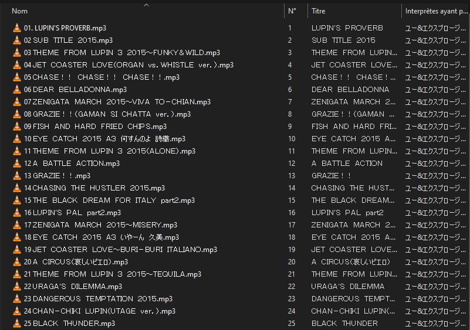
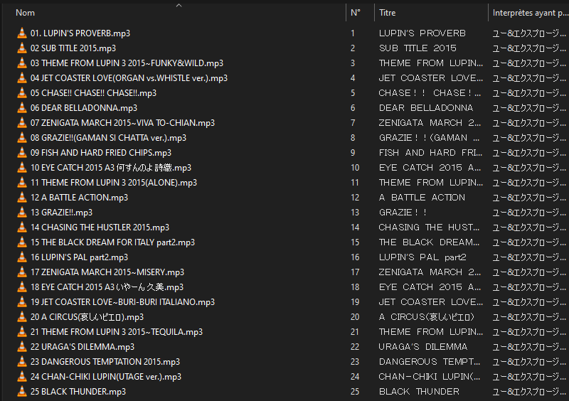

# Mojibake Fixer

Un simple script qui passe sur les fichier et permet de corriger les problèmes de caractères Latin dans des nom de fichiers en Japonais. J'utilise la bibliothèque **ftfy** pour le correction des erreurs.

Avant:

Après:

